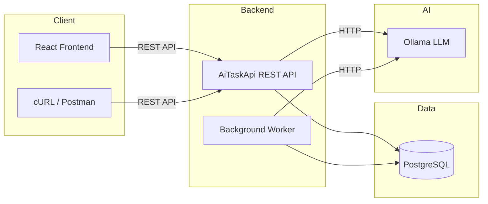

# AiTaskApi

A .NET 10 AI-powered task management system with autonomous agent capabilities.

## System Overview

AiTaskApi combines traditional CRUD task management with an AI-driven autonomous agent powered by [Ollama](https://ollama.ai/) (local LLM server). Users can manage tasks manually through a React frontend or via natural language commands processed by the AI agent.



## Project Structure

```
.
├── README.md                     # This file (project overview)
├── docker-compose.yml            # Docker orchestration
├── docs/                         # Documentation
│   ├── architecture.md           # System architecture and data flow
│   ├── installation.md           # Setup and configuration guide
│   ├── configuration.md          # Configuration options reference
│   ├── usage.md                  # User workflow guide
│   ├── api-reference.md          # Complete API documentation
│   ├── deployment.md             # Deployment guide (Docker, bare-metal, cloud)
│   ├── frontend.md               # Frontend application documentation
│   ├── troubleshooting.md        # Common issues and fixes
│   ├── development.md            # Developer onboarding guide
│   └── faq.md                    # Frequently asked questions
├── backend/                      # Backend codebase
│   ├── AiTaskApi/                # Main REST API (ASP.NET Core 10)
│   ├── AiTaskApi.Shared/         # Shared DTOs, models, helpers
│   ├── AiTaskApi.Worker/         # Background worker service
│   └── AiTaskApi.Tests/          # Unit and integration tests
├── frontend/                     # React + Vite frontend
│   ├── src/                      # Application source code
│   ├── public/                   # Static assets
│   └── Dockerfile                # Frontend container build
└── .github/                      # GitHub templates (issues, PRs)
```

## Quick Start

### Prerequisites

| Software | Version | Purpose |
|----------|---------|---------|
| [.NET 10 SDK](https://dotnet.microsoft.com/download/dotnet/10.0) | 10.0+ | Backend framework |
| PostgreSQL | 14+ | Database |
| [Ollama](https://ollama.ai/) | Latest | AI features (optional) |
| [Docker](https://www.docker.com/) | Latest | Containerized deployment (optional) |

### Option A: Local Development

```bash
# 1. Start PostgreSQL (via Docker or native install)
docker run --name aitaskapi-db -e POSTGRES_PASSWORD=postgres -e POSTGRES_DB=aitaskapi -p 5432:5432 -d postgres:16

# 2. Set JWT secret (required)
$env:JWT_SECRET="your-super-secret-jwt-key-minimum-32-chars-long"

# 3. Start the API
cd backend/AiTaskApi
dotnet restore
dotnet run

# 4. In another terminal, start the Worker
cd ../AiTaskApi.Worker
dotnet restore
dotnet run

# 5. In another terminal, start the frontend
cd ../../frontend
npm install
npm run dev
```

**Endpoints:**
- API: `https://localhost:5001/swagger`
- Frontend: `http://localhost:5173`

### Option B: Docker Compose (All-in-One)

```bash
# 1. Create local Docker settings
cp .env.example .env

# 2. Edit .env if needed
# LLM_SERVER defaults to http://host.docker.internal:11434 for Ollama on the Docker host.

# 3. Start all services
docker compose up --build
```

**Endpoints:**
- API: `http://localhost:5058`
- Frontend: `http://localhost:3000`
- Database: `localhost:5432`

## Key Features

| Feature | Description |
|---------|-------------|
| JWT Authentication | Register/login with Bearer token auth (2-hour expiry) |
| Task CRUD | Full create, read, update, delete with pagination and filtering |
| AI Chat | Simple chat endpoint connected to Ollama LLM |
| AI Task Creation | Natural language to structured task conversion via LLM |
| Autonomous Agent | Planner-based agent that breaks requests into executable steps |
| Async Agent Jobs | Background worker processes agent jobs with retry logic |
| Dream Mode | Idle-time productivity optimization cycle |
| Swagger UI | Auto-generated API documentation (development mode) |

## Documentation

| Document | Description |
|----------|-------------|
| [Architecture](docs/architecture.md) | System architecture, data flow, component responsibilities |
| [Installation](docs/installation.md) | Step-by-step setup guide |
| [Configuration](docs/configuration.md) | All configuration options and environment variables |
| [Usage](docs/usage.md) | User workflows and common operations |
| [API Reference](docs/api-reference.md) | Complete endpoint documentation with examples |
| [Deployment](docs/deployment.md) | Docker, bare-metal, and cloud deployment guides |
| [Frontend](docs/frontend.md) | Frontend application structure and configuration |
| [Troubleshooting](docs/troubleshooting.md) | Common issues and solutions |
| [Development](docs/development.md) | Developer onboarding and codebase conventions |
| [FAQ](docs/faq.md) | Frequently asked questions |

## Configuration

Before running, configure your environment:

```bash
# Backend
cp backend/.env.example backend/.env.local

# Frontend
cp frontend/.env.example frontend/.env.local

# Docker (optional)
cp docker-compose.example.yml docker-compose.yml
# Edit docker-compose.yml with your settings
```

**Important:** The JWT signing key must be set via the `JWT_SECRET` environment variable or `Jwt:Secret` configuration value. See [`backend/.env.example`](backend/.env.example).

## Security

This project follows security best practices:

- No hardcoded secrets in source code
- Passwords hashed with BCrypt.Net-Next
- JWT secrets externalized to environment variables
- Example configuration files provided (never commit `.env` files)

See [`CONTRIBUTING.md#security`](./CONTRIBUTING.md#security) for more details.

## License

This project is licensed under the [MIT License](./LICENSE).
