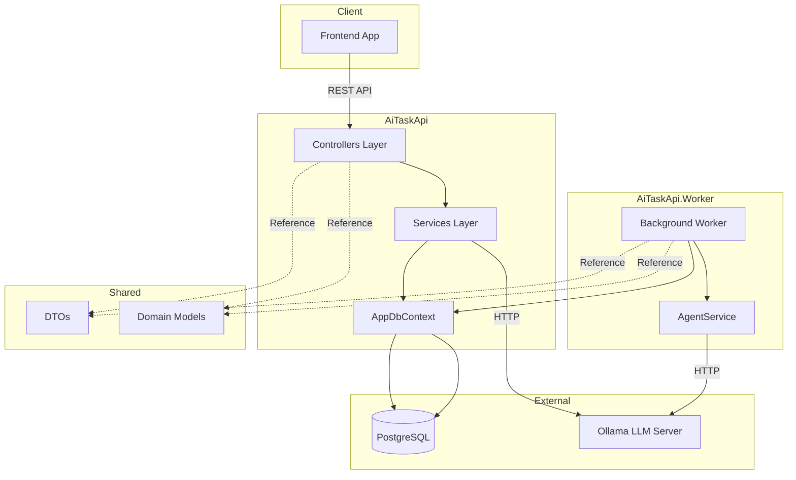
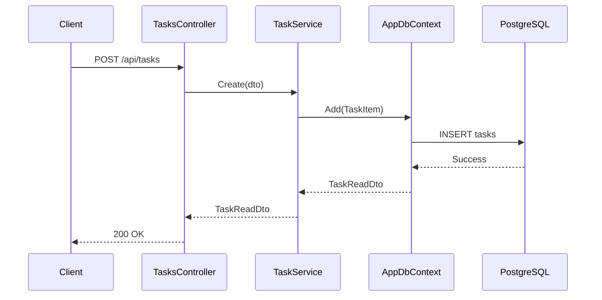
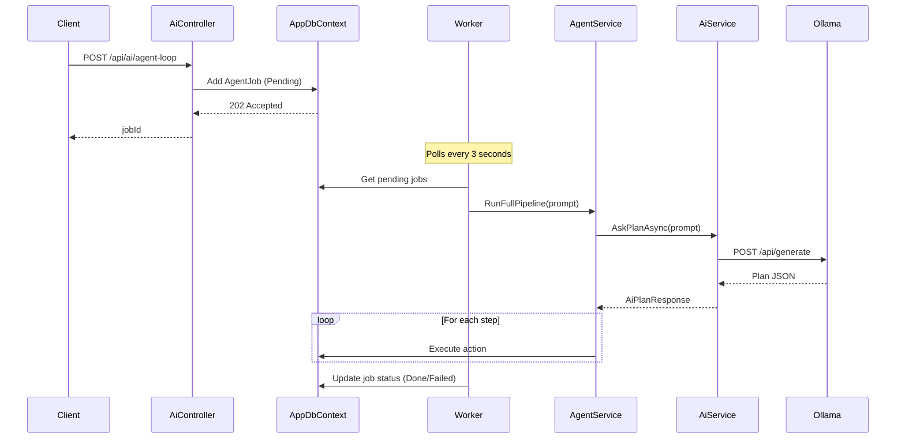
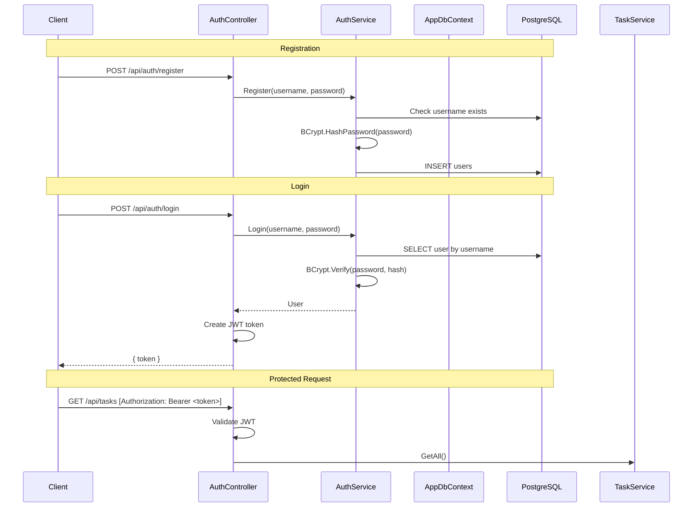

# Architecture

## System Overview

AiTaskApi is a microservice-style backend composed of three independent but interconnected projects:

## Project Responsibilities

### AiTaskApi (REST API Server)

The main web application built on ASP.NET Core 10. Handles all HTTP requests.

**Layers:**

| Layer | Location | Responsibility |
|-------|----------|----------------|
| Controllers | [`Controllers/`](../AiTaskApi/Controllers/) | HTTP request handling, routing |
| Services | [`Services/`](../AiTaskApi/Services/) | Business logic |
| Data | [`Data/`](../AiTaskApi/Data/) | EF Core DbContext and database access |
| Models | [`Models/`](../AiTaskApi/Models/) + [`DTOs/`](../AiTaskApi/DTOs/) | Domain models and request/response DTOs |
| Common | [`Common/`](../AiTaskApi/Common/) | Shared utilities (e.g., ApiResponseHelper) |

**Note:** The `WeatherForecastController.cs` file is a template controller included by ASP.NET Core and is not part of the application's core functionality.

**Key Controllers:**

| Controller | Route | Purpose |
|------------|-------|---------|
| [`AuthController`](../AiTaskApi/Controllers/AuthController.cs) | `/api/auth` | User registration and JWT authentication |
| [`TasksController`](../AiTaskApi/Controllers/TasksController.cs) | `/api/tasks` | Task CRUD operations with pagination |
| [`AiController`](../AiTaskApi/Controllers/AiController.cs) | `/api/ai` | AI chat, task creation, agent management |

### AiTaskApi.Shared (Shared Library)

A .NET class library containing models and DTOs shared between the API and Worker projects.

**Contents:**

| Folder | Contents |
|--------|----------|
| [`DTOs/`](../AiTaskApi.Shared/DTOs/) | `TaskCreateDto`, `TaskReadDto`, `AiTaskResult` |
| [`Models/`](../AiTaskApi.Shared/Models/) | `TaskItem`, `AgentJob`, `AgentMemory`, `AiActionResponse`, `AiPlanResponse` |
| [`Helper/`](../AiTaskApi.Shared/Helper/) | `AgentType` enum, `ServerAddress` static helper |

### AiTaskApi.Worker (Background Service)

A .NET Worker Service that processes AI agent jobs asynchronously.

**Responsibilities:**

1. Polls the database for pending `AgentJob` records
2. Executes agent pipelines via [`AgentService`](../AiTaskApi/Services/AgentService.cs)
3. Implements retry logic with exponential backoff
4. Runs "Dream Mode" cycles when idle and Ollama is available

### AiTaskApi.Tests (Test Project)

Contains integration and unit tests:

| File | Purpose |
|------|---------|
| [`TaskApiIntegrationTests.cs`](../AiTaskApi.Tests/TaskApiIntegrationTests.cs) | API endpoint integration tests |
| [`TaskServiceTests.cs`](../AiTaskApi.Tests/TaskServiceTests.cs) | TaskService unit tests |
| [`FakeAiService.cs`](../AiTaskApi.Tests/FakeAiService.cs) | Mock AI service for testing |
| [`TestAuthHandler.cs`](../AiTaskApi.Tests/TestAuthHandler.cs) | Test JWT authentication handler |

## Data Flow

### Task Creation (Manual)

### AI Task Creation (Async Agent)

## Authentication Flow

## Agent Types

The system supports four agent types defined in [`AgentType`](../AiTaskApi.Shared/Helper/AgentType.cs):

| Type | Description |
|------|-------------|
| `Planner` | Breaks user requests into executable steps |
| `Executor` | Executes individual plan steps |
| `Critic` | Reviews and validates plan results (placeholder) |
| `Dreamer` | Runs idle-time productivity optimization |

## Configuration Architecture

Configuration is resolved in the following priority order (highest to lowest):

1. Environment variables (e.g., `ConnectionStrings__Default`, `LLM_SERVER`)
2. `appsettings.{Environment}.json` files
3. Hardcoded defaults in code

**Key configuration points:**

| Setting | Source | Default |
|---------|--------|---------|
| Database connection | `ConnectionStrings__Default` env or `appsettings.json` | Empty (must be set) |
| LLM server URL | `LLM_SERVER` env or [`ServerAddress.LlmServer`](../AiTaskApi.Shared/Helper/ServerAddress.cs) | `http://host.docker.internal:11434` (Docker) / `http://localhost:11434` (local) |
| Ollama model | `OLLAMA_MODEL` env or code default | `gemma4:e4b` |
| JWT secret | Environment variable `JWT_SECRET` or config `Jwt:Secret` | Required (must be set before running) |
| CORS origins | [`Program.cs`](../AiTaskApi/Program.cs:54-63) | `http://localhost:5173`, `http://localhost:3000` |
| Agent retry delay | Hardcoded in [`Worker.cs`](../AiTaskApi.Worker/Worker.cs:10) | 10 seconds |

## Security Considerations

- The JWT signing key is externalized via `JWT_SECRET` environment variable or `Jwt:Secret` configuration ([`Program.cs`](../AiTaskApi/Program.cs:71-74)).
- Passwords are hashed using BCrypt.Net-Next (industry standard).
- CORS is configured for specific localhost origins; adjust for production frontend domains.
- HTTPS redirection is enabled by default.
