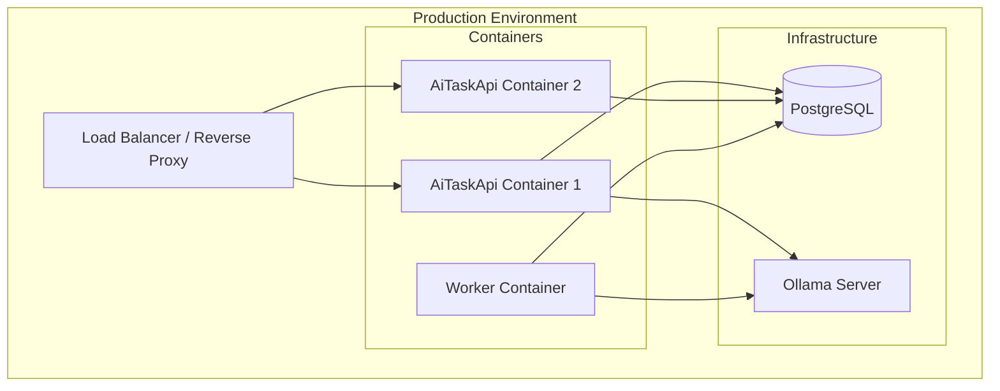

# Deployment Guide

## Overview

AiTaskApi supports multiple deployment targets: Docker Compose (recommended), individual containers, or bare-metal hosting.

## Architecture for Deployment



## Option 1: Docker Compose (Recommended)

### Production docker-compose.yml

```yaml
version: "3.9"

services:
  db:
    image: postgres:16
    container_name: aitaskapi_db
    restart: always
    environment:
      POSTGRES_USER: ${DB_USER:-postgres}
      POSTGRES_PASSWORD: ${DB_PASSWORD:-changeme}
      POSTGRES_DB: ${DB_NAME:-aitaskapi}
    volumes:
      - pgdata:/var/lib/postgresql/data
    networks:
      - app-network

  api:
    build:
      context: ./backend
      dockerfile: AiTaskApi/Dockerfile
    container_name: aitaskapi_api
    restart: always
    depends_on:
      - db
    environment:
      ConnectionStrings__Default: Host=db;Port=5432;Database=${DB_NAME:-aitaskapi};Username=${DB_USER:-postgres};Password=${DB_PASSWORD:-changeme}
      JWT_SECRET: ${JWT_SECRET:-change-me-jwt-secret}
      LLM_SERVER: ${LLM_SERVER:-http://ollama:11434}
      OLLAMA_MODEL: ${OLLAMA_MODEL:-gemma4:e4b}
      ASPNETCORE_ENVIRONMENT: Production
      ASPNETCORE_URLS: http://+:8080
    ports:
      - "5058:8080"
    networks:
      - app-network

  worker:
    build:
      context: ./backend
      dockerfile: AiTaskApi.Worker/Dockerfile
    container_name: aitaskapi_worker
    restart: always
    depends_on:
      - db
    environment:
      ConnectionStrings__Default: Host=db;Port=5432;Database=${DB_NAME:-aitaskapi};Username=${DB_USER:-postgres};Password=${DB_PASSWORD:-changeme}
      JWT_SECRET: ${JWT_SECRET:-change-me-jwt-secret}
      LLM_SERVER: ${LLM_SERVER:-http://ollama:11434}
      OLLAMA_MODEL: ${OLLAMA_MODEL:-gemma4:e4b}
    networks:
      - app-network

  frontend:
    build:
      context: ./frontend
    container_name: aitaskapi_frontend
    restart: always
    depends_on:
      - api
    ports:
      - "3000:80"
    networks:
      - app-network

volumes:
  pgdata:

networks:
  app-network:
    driver: bridge
```

### Environment File (.env)

```bash
# Database
DB_USER=postgres
DB_PASSWORD=your-secure-password-here
DB_NAME=aitaskapi

# AI
LLM_SERVER=http://host.docker.internal:11434
OLLAMA_MODEL=gemma4:e4b

# Security (REQUIRED)
JWT_SECRET=your-super-secret-jwt-key-minimum-32-chars-long
```

### Deploy

```bash
# Build and start all services
docker-compose up -d --build

# Check status
docker-compose ps

# View logs
docker-compose logs -f api

# Stop
docker-compose down

# Stop with volume cleanup (WARNING: deletes database)
docker-compose down -v
```

## Option 2: Bare-Metal Deployment

### Step 1: Build Release Binaries

```bash
# API
cd backend/AiTaskApi
dotnet publish -c Release -o ./publish /p:PublishSingleFile=true /p:CopyRefAssembliesToPublishDirectory=false

# Worker
cd ../AiTaskApi.Worker
dotnet publish -c Release -o ./publish-worker /p:PublishSingleFile=true /p:CopyRefAssembliesToPublishDirectory=false
```

### Step 2: Configure Production Settings

Create `appsettings.Production.json` in the API directory:

```json
{
  "Logging": {
    "LogLevel": {
      "Default": "Warning",
      "Microsoft.AspNetCore": "Warning"
    }
  },
  "ConnectionStrings": {
    "Default": "Host=your-db-host;Database=aitaskapi;Username=appuser;Password=securepassword"
  }
}
```

### Step 3: Run with Systemd (Linux)

**API Service (`/etc/systemd/system/aitaskapi.service`):**

```ini
[Unit]
Description=AiTaskApi REST API
After=network.target postgresql.service

[Service]
WorkingDirectory=/opt/aitaskapi/AiTaskApi/publish
ExecStart=/usr/bin/dotnet AiTaskApi.dll
Restart=always
RestartSec=10
User=www-data
Environment=ASPNETCORE_ENVIRONMENT=Production
Environment=ConnectionStrings__Default=Host=localhost;Database=aitaskapi;Username=appuser;Password=securepassword
Environment=JWT_SECRET=your-super-secret-jwt-key-minimum-32-chars-long
Environment=LLM_SERVER=http://localhost:11434
Environment=OLLAMA_MODEL=gemma4:e4b

[Install]
WantedBy=multi-user.target
```

**Worker Service (`/etc/systemd/system/aitaskapi-worker.service`):**

```ini
[Unit]
Description=AiTaskApi Background Worker
After=network.target postgresql.service

[Service]
WorkingDirectory=/opt/aitaskapi/AiTaskApi.Worker/publish-worker
ExecStart=/usr/bin/dotnet AiTaskApi.Worker.dll
Restart=always
RestartSec=10
User=www-data
Environment=ConnectionStrings__Default=Host=localhost;Database=aitaskapi;Username=appuser;Password=securepassword
Environment=JWT_SECRET=your-super-secret-jwt-key-minimum-32-chars-long
Environment=LLM_SERVER=http://localhost:11434

[Install]
WantedBy=multi-user.target
```

**Start services:**

```bash
sudo systemctl daemon-reload
sudo systemctl enable aitaskapi
sudo systemctl enable aitaskapi-worker
sudo systemctl start aitaskapi
sudo systemctl start aitaskapi-worker
sudo systemctl status aitaskapi
```

### Step 4: Frontend Deployment

Build the React frontend:

```bash
cd frontend
npm install
npm run build
```

The built files will be in `frontend/dist/`. Serve them with any static file server (nginx, Apache, etc.).

## Option 3: Cloud Deployment

### Azure App Service

```bash
# Create resource group
az group create --name aitaskapi-rg --location eastus

# Create API app service
az webapp create --resource-group aitaskapi-rg --name aitaskapi-api --runtime "DOTNET|10" --plan myAppServicePlan

# Configure connection strings
az webapp config appsettings set --resource-group aitaskapi-rg --name aitaskapi-api --settings ConnectionStrings__Default="Host=your-db.postgres.database.azure.com;Database=aitaskapi;Username=appuser@yourserver;Password=securepassword" JWT_SECRET="your-super-secret-jwt-key-minimum-32-chars-long"

# Deploy
cd backend/AiTaskApi
dotnet publish -c Release -o ./publish
az webapp deploy --resource-group aitaskapi-rg --name aitaskapi-api --src-path ./publish --type zip
```

### AWS ECS (via Docker)

```bash
# Build and push to ECR
aws ecr create-repository --repository-name aitaskapi
docker tag aitaskapi:latest <account>.dkr.ecr.<region>.amazonaws.com/aitaskapi:latest
docker push <account>.dkr.ecr.<region>.amazonaws.com/aitaskapi:latest

# Deploy to ECS cluster (requires task definition JSON)
aws ecs register-task-definition --cli-input-json file://ecs-task-definition.json
aws ecs update-service --cluster aitaskapi-cluster --service aitaskapi-service --force-new-deployment
```

## Reverse Proxy Configuration

### Nginx Configuration (`/etc/nginx/sites-available/aitaskapi`)

```nginx
server {
    listen 80;
    server_name your-domain.com;

    # Frontend
    location / {
        root /var/www/aitaskapi-frontend;
        index index.html;
        try_files $uri $uri/ /index.html;
    }

    # API proxy
    location /api/ {
        proxy_pass http://localhost:5058/api/;
        proxy_http_version 1.1;
        proxy_set_header Upgrade $http_upgrade;
        proxy_set_header Connection 'upgrade';
        proxy_set_header Host $host;
        proxy_set_header X-Real-IP $remote_addr;
        proxy_set_header X-Forwarded-For $proxy_add_x_forwarded_for;
        proxy_set_header X-Forwarded-Proto $scheme;
        proxy_cache_bypass $http_upgrade;
    }

    # Swagger UI
    location /swagger {
        proxy_pass http://localhost:5058/swagger;
    }
}
```

### SSL with Let's Encrypt

```bash
sudo apt install certbot python3-certbot-nginx
sudo certbot --nginx -d your-domain.com
```

## Security Checklist for Production

| Item | Status | Notes |
|------|--------|-------|
| JWT signing key | Configurable via `JWT_SECRET` env var | Set before running (required) |
| Database password | Default `postgres` | Change to strong password |
| CORS origins | Only localhost | Add production frontend domains |
| HTTPS | Development certificates only | Install production SSL certificates |
| Rate limiting | Not configured | Add rate limiting middleware |
| Input validation | Basic DTO constraints | Add FluentValidation or similar |
| Logging | Default (Warning level for Microsoft.*) | Configure Serilog with file/ELK output |
| Admin endpoints | No admin authentication | Add role-based access control |

## Monitoring and Maintenance

### Health Checks

```bash
# API health
curl http://localhost:5058/weatherforecast 2>/dev/null || echo "Health check endpoint not explicitly configured"

# Database connectivity
docker exec aitaskapi_db pg_isready -U postgres

# Ollama status
curl http://localhost:11434/api/ps
```

### Backup PostgreSQL

```bash
# Daily backup
# docker exec aitaskapi_db pg_dump -U postgres aitaskapi > backups/aitaskapi_$(date +%Y%m%d).sql

# Restore
# cat backups/aitaskapi_YYYYMMDD.sql | docker exec -i aitaskapi_db psql -U postgres aitaskapi
```

### Log Rotation

For systemd deployments, configure logrotate:

```bash
sudo nano /etc/logrotate.d/aitaskapi
```

```
/opt/aitaskapi/*/logs/*.log {
    daily
    rotate 7
    compress
    missingok
    notifempty
}
```

## Scaling Considerations

| Area | Recommendation |
|------|---------------|
| API | Stateless - scale horizontally with load balancer |
| Worker | Currently sequential - implement parallel job processing for high throughput |
| Database | Use connection pooling (PgBouncer) for multiple API instances |
| AI | Ollama can be a bottleneck - consider dedicated GPU server or queue-based architecture |
